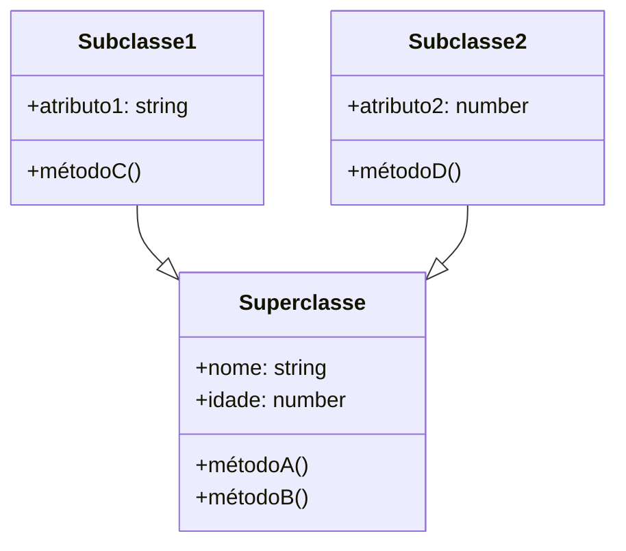

<h1 align="center">
  
</h1>

# POO com Typescript

Turma Online ON36 - Imersão JavaScript | Semana 02 | 2024 | Professora Jessica Felix

### Instruções
Antes de começar, vamos organizar nosso setup.
* Fork esse repositório 
* Clone o fork na sua máquina (Para isso basta abrir o seu terminal e digitar `git clone url-do-seu-repositorio-forkado`)
* Entre na pasta do seu repositório (Para isso basta abrir o seu terminal e digitar `cd nome-do-seu-repositorio-forkado`)
* [Add outras intrucoes caso necessario]

### Objetivo
- Compreeender a aplicação de herança, polimorfismo e encapsulamento em typescript
- Criar classes em typescript seguindo as boas práticas de POO
- Criar código de acordo com diagramas de classe
- Aplicar o conceito de interface

### Resumo

O que veremos na aula de hoje?
- [POO com Typescript](#tema-da-aula)
    - [Instruções](#instruções)
    - [Objetivo](#objetivo)
    - [Resumo](#resumo)

- [Conteúdo](#conteúdo)

  - [Programação Orientada a Objetos Usando Typescript](#programação-orientada-a-objetos-usando-typescript)
    - [Classes ](#classes)
    - [Herança](#herança)
    - [Herança Multipla](#herança-multipla)
    - [Superclasse e Subclasse](#superclasse-e-subclasse)
    - [Sobrescrita de métodos em subclasses em TypeScript](#sobrescrita-de-métodos-em-subclasses-em-typescript)
    - [Mixins](#mixins)
    - [Mixins e Interfaces](#mixins-e-interfaces)
    - [Quando usar mixins e quando usar interface?](#)
    - [Impacto na Performance](#)
  

  - [Exercícios](#exercícios)
  - [Material da aula](#material-da-aula)
  - [Links Úteis](#links-úteis)

# Conteúdo

## Programação Orientada a Objetos Usando Typescript
A programação orientada a objetos (POO) em TypeScript segue os mesmos princípios básicos de outras linguagens orientadas a objetos, como a definição de classes, herança, polimorfismo e encapsulamento.
Em TypeScript, uma classe é definida usando a palavra-chave class e pode conter propriedades (atributos) e métodos. Os objetos são instâncias dessas classes, criados usando o operador new.
Por exemplo, podemos criar uma classe Pessoa com propriedades nome e idade, e um método apresentar() que exibe essas informações:

```typescript
class Pessoa {
  nome: string;
  idade: number;

  constructor(nome: string, idade: number) {
    this.nome = nome;
    this.idade = idade;
  }

  apresentar() {
    console.log(`Olá! Meu nome é ${this.nome} e tenho ${this.idade} anos.`);
  }
}

const pessoa1 = new Pessoa("João", 25);
pessoa1.apresentar();
```
Além disso, TypeScript suporta conceitos avançados de POO, como herança, polimorfismo e interfaces. Esses recursos ajudam a escrever código mais organizado, reutilizável e escalável.

  #### Classes
  As classes em programação orientada a objetos são como "moldes" ou "modelos" a partir dos quais são criados objetos. Elas definem a estrutura e o comportamento desses objetos. É possível criar instâncias de uma classe (objetos), que, usando uma analogia bem simples, seria como usar um cortador de biscoitos em uma massa, onde nossa classe seria o cortador.

As classes contêm atributos (dados) e métodos (funções) que descrevem as características e comportamentos dos objetos. Quando criamos uma instância de classe, esse objeto herda os atributos e métodos da classe. Talvez você já tenha ouvido o termo “classe-pai” ou “classe-base” que quer dizer a mesma coisa e “classe-filha” porque, assim como na genética, que os filhos carregam características dos pais, nossos objetos também carregam as características (métodos e atributos) das suas superclasses.

Para não causar confusões, vamos usar superclasse para nos referirmos às classes-base ou classes-pai e sub-classes para as classes filhas.

A superclasse é essencial na programação orientada a objetos,já que estabelece a estrutura e o comportamento básico que será herdado pelas subclasses, promovendo a reutilização de código e a organização hierárquica das classes.


Este diagrama apresenta uma superclasse com atributos nome e idade, e métodos métodoA e métodoB. Duas subclasses, Subclasse1 e Subclasse2, herdam esses atributos e métodos da superclasse. Cada subclasse adiciona seus próprios atributos e métodos (métodoC e métodoD, respectivamente).

### Herança
A seta para cima, que representa a palavra reservada extends indica que Subclasse1 e Subclasse2 são subclasses da superclasse. Para essa ideia do extends fazer mais sentido, vamos dizer que “a Subclasse2 estende(extends) os métodos e atributos da Superclasse”, que representado em código, seria 
class Subclasse1 extends Superclasse. O símbolo 1..* indica que uma superclasse pode ter várias subclasses.

#### Herança Multipla
TypeScript não suporta herança múltipla de classes diretamente. Isso significa que uma classe não pode estender de múltiplas classes ao mesmo tempo.
No entanto, TypeScript oferece suporte a herança única e herança multinível. Uma classe pode estender de outra classe e herdar seus métodos e propriedades.
Embora TypeScript não permita herança múltipla de classes, é possível simular esse comportamento usando interfaces: uma classe pode implementar múltiplas interfaces, cada uma contendo métodos e propriedades específicas.

Além disso, é possível usar o padrão de projeto Mixin em TypeScript para obter um comportamento semelhante à herança múltipla. Isso envolve combinar múltiplas classes em uma única classe usando funções:

```typescript
// Interface para a classe Pessoa
interface Pessoa {
  nome: string;
  idade: number;
}

// Interface para a classe Autor
interface Autor extends Pessoa {
  livro: string;
}

// Interface para a classe Leitor
interface Leitor extends Pessoa {
  livro: string;
}

// Classe PessoaBase que implementa a interface Pessoa
class PessoaBase implements Pessoa {
  nome: string;
  idade: number;

  constructor(nome: string, idade: number) {
    this.nome = nome;
    this.idade = idade;
  }
}

// Classe Autor que implementa a interface Autor e estende a classe PessoaBase
class Autor extends PessoaBase implements Autor {
  livro: string;

  constructor(nome: string, idade: number, livro: string) {
    super(nome, idade);
    this.livro = livro;
  }
}

// Classe Leitor que implementa a interface Leitor e estende a classe PessoaBase
class Leitor extends PessoaBase implements Leitor {
  livro: string;

  constructor(nome: string, idade: number, livro: string) {
    super(nome, idade);
    this.livro = livro;
  }
}

// Instanciando as classes
const autor = new Autor("João", 25, "Livro de Autor");
console.log(autor.nome); // Output: João
console.log(autor.livro); // Output: Livro de Autor

const leitor = new Leitor("Maria", 30, "Livro de Leitor");
console.log(leitor.nome); // Output: Maria
console.log(leitor.livro); // Output: Livro de Leitor
```

Neste exemplo, as classes Autor e Leitor estendem a classe PessoaBase, que implementa a interface Pessoa. As classes Autor e Leitor também implementam suas próprias interfaces, Autor e Leitor, que estendem a interface Pessoa.
Isso permite que as classes Autor e Leitor herdem métodos e propriedades da classe PessoaBase e também implementem métodos e propriedades adicionais definidos nas suas próprias interfaces.

Embora isso não seja exatamente herança múltipla, é uma abordagem que permite a combinação de comportamentos de múltiplas interfaces em uma única classe.

De curiosidade, você pode encontrar herança múltipla em linguagens de programação como  C++ e Swift, porém,  a herança múltipla pode gerar complexidades e ambiguidades no código, o que levou linguagens modernas, como o Java ou Typescript a optarem por não suportar esse recurso.

#### Superclasse e Subclasse

##### Superclasse
Em TypeScript, a definição de uma superclasse é muito similar à definição em Java:

```Typescript
class Animal {
  protected name: string;
  private age: number;

  constructor(name: string, age: number) {
    this.name = name;
    this.age = age;
  }

  speak() {
    console.log(`${this.name} faz um som.`);
  }
}
```
Neste exemplo, a classe Animal é a superclasse. Ela possui:
Propriedades name (protegida) e age (privada)
Um construtor que inicializa essas propriedades
Um método speak() que imprime uma mensagem

##### Subclasse
As subclasses em TypeScript são definidas usando a palavra-chave extends após o nome da classe, seguida do nome da superclasse:

```Typescript
class Dog extends Animal {
  private breed: string;

  constructor(name: string, age: number, breed: string) {
    super(name, age);
    this.breed = breed;
  }

  speak() {
    console.log(`${this.name} late.`);
  }
}
```
Neste exemplo, a classe Dog é uma subclasse de Animal. Ela:
Herda as propriedades name (protegida) e age (privada) da superclasse Animal
Possui uma propriedade adicional breed (privada)
Possui um construtor que chama o construtor da superclasse usando super(name, age) e inicializa a propriedade breed
Sobrescreve o método speak() da superclasse, fornecendo uma implementação específica para cães

##### Sobrescrita de métodos em subclasses em TypeScript 

Em TypeScript, a sobrescrita de métodos em subclasses é feita de maneira semelhante a outras linguagens orientadas a objetos, como Java e C#. Aqui estão os principais pontos sobre como realizar a sobrescrita de métodos em TypeScript:
Declaração do Método na Superclasse: O método que será sobrescrito deve ser declarado na superclasse. Ele pode ter qualquer modificador de acesso (público, protegido ou privado).
Declaração do Método na Subclasse: Na subclasse, você declara um método com o mesmo nome e assinatura (parâmetros e tipo de retorno) do método da superclasse que você deseja sobrescrever.
Uso da Palavra-Chave override: Opcionalmente, você pode usar a palavra-chave override na declaração do método na subclasse para indicar que está sobrescrevendo um método da superclasse.

```Typescript
class Animal {
  protected name: string;

  constructor(name: string) {
    this.name = name;
  }

  speak(): void {
    console.log(`${this.name} faz um som.`);
  }
}

class Dog extends Animal {
  constructor(name: string) {
    super(name);
  }

  override speak(): void {
    console.log(`${this.name} late.`);
  }
}

const dog = new Dog('Rex');
dog.speak(); // Output: "Rex late."
```
#### Mixins
A prática de usar mixins em TypeScript é considerada uma abordagem válida e recomendada em determinados cenários, embora não seja a única solução disponível.
Vantagens do uso de mixins em TypeScript:
- Flexibilidade: Mixins permitem que você combine comportamentos de múltiplas classes em uma única classe, o que pode ser útil quando você precisa de funcionalidades de diferentes fontes.
- Reusabilidade: Ao encapsular comportamentos em mixins, você pode reutilizar esses comportamentos em diferentes classes, promovendo a modularidade e a reutilização de código.
- Evita herança múltipla: Como TypeScript não suporta herança múltipla de classes, os mixins fornecem uma alternativa para alcançar um comportamento semelhante.
Composição sobre herança: Os mixins seguem o princípio de "composição sobre herança", o que é geralmente considerado uma abordagem mais flexível e escalável.
Entretanto, é importante considerar algumas considerações ao usar mixins em TypeScript:
- Complexidade: A implementação de mixins pode tornar o código mais complexo, especialmente em casos mais avançados. É importante manter a simplicidade e a legibilidade do código.
- Ordem de aplicação: A ordem em que os mixins são aplicados pode afetar o comportamento final da classe. Isso requer cuidado e entendimento do fluxo de execução.
Tipagem: A tipagem de classes que utilizam mixins pode ser mais desafiadora, pois você precisa lidar com a composição de tipos.
Portanto, a prática de usar mixins em TypeScript é recomendada, especialmente em situações em que a herança múltipla de classes seria benéfica, mas não é suportada nativamente pela linguagem. No entanto, é importante avaliar cuidadosamente os trade-offs e manter o código organizado e legível.

##### Mixins e Interfaces

Os mixins em TypeScript se comportam de maneira diferente das interfaces, embora ambos sejam usados para estender e compor funcionalidades em classes. Aqui estão as principais diferenças:
- Herança vs Composição:
  Interfaces definem um contrato que classes devem seguir, mas não adicionam implementação.
  Mixins adicionam implementação e comportamento a uma classe, usando composição em vez de herança.
- Múltipla Herança:
  Interfaces permitem que uma classe implemente múltiplas interfaces, simulando herança múltipla.
  Mixins permitem que uma classe "herde" de múltiplas classes, fornecendo uma alternativa à herança múltipla, que não é suportada nativamente em TypeScript.
- Flexibilidade:
  Mixins oferecem mais flexibilidade, pois permitem combinar comportamentos de diferentes classes em uma única classe.
  Interfaces são mais rígidas, pois definem apenas a forma que uma classe deve ter, sem adicionar implementação.
- Complexidade:
  O uso de mixins pode tornar o código mais complexo, especialmente quando há muitas camadas de composição.
  Interfaces tendem a manter o código mais simples e legível, pois apenas definem contratos.
- Tipagem:
  Interfaces são mais fáceis de tipar, pois apenas definem a forma de um objeto.
  Mixins podem exigir um esforço maior na definição de tipos, especialmente quando há composição de múltiplos mixins.

##### Quando usar Mixins e quando usar interfaces?

Interfaces são geralmente mais recomendadas do que mixins em TypeScript nas seguintes situações:
- Definição de Contratos: Interfaces são ideais para definir contratos ou "formas" de objetos, especificando quais propriedades e métodos devem estar presentes. Isso ajuda a garantir a consistência e a interoperabilidade entre diferentes partes do código.
- Simplicidade e Legibilidade: Interfaces tendem a manter o código mais simples e legível, pois apenas definem a estrutura de um objeto, sem adicionar implementação. Isso pode ser preferível em situações em que a complexidade deve ser minimizada.
- Tipagem Mais Simples: A tipagem de código que usa interfaces é geralmente mais simples e direta do que a tipagem de código que usa mixins, que pode exigir mais esforço na definição de tipos compostos.
- Herança Múltipla de Tipos: Interfaces permitem que uma classe implemente múltiplas interfaces, o que simula a herança múltipla de tipos. Isso pode ser mais adequado do que usar mixins, especialmente quando não há necessidade de adicionar implementação.
- Compatibilidade com Bibliotecas Externas: Quando você está trabalhando com bibliotecas externas que esperam tipos definidos por interfaces, é mais natural e compatível usar interfaces em vez de mixins.
- 
Por outro lado, mixins são mais recomendados em situações em que você precisa compor comportamentos de múltiplas classes em uma única classe, especialmente quando a herança múltipla de classes seria benéfica, mas não é suportada nativamente em TypeScript.

Algumas situações em que mixins podem ser mais apropriados do que interfaces:
- Composição de Comportamentos: Quando você precisa combinar funcionalidades de múltiplas classes em uma única classe, os mixins oferecem uma abordagem mais flexível do que a herança tradicional.
- Reutilização de Código: Mixins permitem encapsular e reutilizar comportamentos em diferentes classes, promovendo a modularidade e a reutilização de código.
- Necessidade de Implementação Adicional: Quando você precisa adicionar implementação específica a uma classe, além de apenas definir sua estrutura, os mixins podem ser uma solução mais adequada do que as interfaces.

##### Impacto em Performance

A escolha entre interfaces e mixins em TypeScript pode ter impactos na performance do código, embora esses impactos geralmente sejam pequenos. Aqui estão alguns pontos a considerar:
- Complexidade do Código:
  Interfaces tendem a manter o código mais simples e legível, o que pode melhorar a performance geral, pois o compilador e o interpretador têm menos código para processar.
  Mixins podem tornar o código mais complexo, especialmente quando há muitas camadas de composição. Essa complexidade adicional pode ter um impacto leve na performance.
- Tempo de Compilação:
  O uso de interfaces geralmente resulta em um tempo de compilação mais rápido, pois elas são mais simples e fáceis de processar pelo compilador.
  Mixins podem aumentar o tempo de compilação, especialmente quando há muitas classes sendo compostas.
- Tamanho do Código Gerado:
  Interfaces adicionam pouco ou nenhum código extra ao resultado final, mantendo o tamanho do código gerado pequeno.
  Mixins podem gerar mais código, pois eles precisam adicionar a implementação dos métodos e propriedades compostos à classe final.
- Otimização do Interpretador:
  Interfaces tendem a ser mais fáceis de otimizar pelo interpretador, pois sua estrutura é mais simples e previsível.
  Mixins podem dificultar a otimização do interpretador, pois a composição de comportamentos pode criar estruturas mais complexas.
  
É importante notar que, em geral, esses impactos na performance são relativamente pequenos e podem ser negligenciáveis em muitos casos. A escolha entre interfaces e mixins deve ser feita com base na legibilidade, flexibilidade e manutenibilidade do código, em vez de focar apenas na performance.
Além disso, existem técnicas e configurações do compilador TypeScript que podem ajudar a mitigar alguns desses impactos, como o uso de --extendedDiagnostics para identificar gargalos de performance e a configuração de opções como strictFunctionTypes para melhorar a solidez do sistema de tipos.

***
### Exercícios 
* [Exercicio para sala](/exercicios/para-sala/)
* [Exercicio para casa](/exercicios/para-casa/)

### Material da aula 
* [Material](/material)

### Links Úteis
* 

<p align="center">
Desenvolvido com :purple_heart:  
</p>

