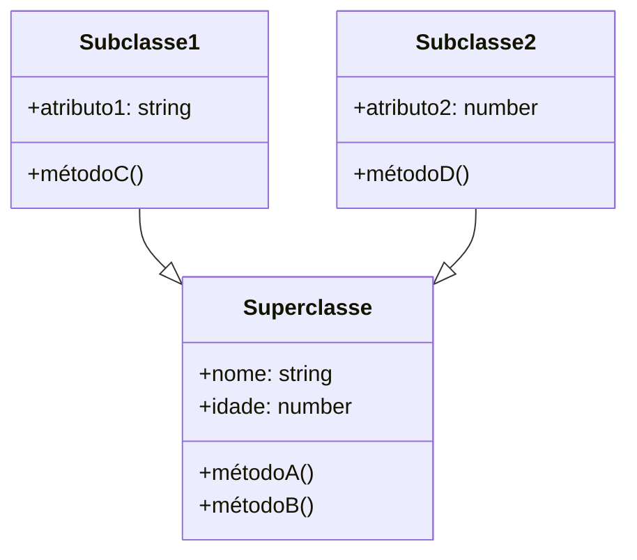

<h1 align="center">
  
</h1>

# POO com Typescript

Turma Online ON36 - Imersão JavaScript | Semana 02 | 2024 | Professora Jessica Felix

### Instruções
Antes de começar, vamos organizar nosso setup.
* Fork esse repositório 
* Clone o fork na sua máquina (Para isso basta abrir o seu terminal e digitar `git clone url-do-seu-repositorio-forkado`)
* Entre na pasta do seu repositório (Para isso basta abrir o seu terminal e digitar `cd nome-do-seu-repositorio-forkado`)
* [Add outras intrucoes caso necessario]

### Objetivo
- Compreeender a aplicação de herança, polimorfismo e encapsulamento em typescript
- Criar classes em typescript seguindo as boas práticas de POO
- Criar código de acordo com diagramas de classe
- Aplicar o conceito de interface

### Resumo

O que veremos na aula de hoje?
- [POO com Typescript](#tema-da-aula)
    - [Instruções](#instruções)
    - [Objetivo](#objetivo)
    - [Resumo](#resumo)

- [Conteúdo](#conteúdo)

  - [Exemplo](#exemplo)
    - [O que são e para que servem ](#o-que-são-e-para-que-servem)
    - [Benefícios](#benefícios)
    - [Abordagens](#abordagens)
    - [Implementação](#implementação)
  
  - [Outro Exemplo](#outro-exemplo)
    - [ETCETC](#etcetc)

  - [Exercícios](#exercícios)
  - [Material da aula](#material-da-aula)
  - [Links Úteis](#links-úteis)

# Conteúdo

## Programação Orientada a Objetos Usando Typescript
  #### O que são e para que servem
A programação orientada a objetos (POO) em TypeScript segue os mesmos princípios básicos de outras linguagens orientadas a objetos, como a definição de classes, herança, polimorfismo e encapsulamento.
Em TypeScript, uma classe é definida usando a palavra-chave class e pode conter propriedades (atributos) e métodos. Os objetos são instâncias dessas classes, criados usando o operador new.
Por exemplo, podemos criar uma classe Pessoa com propriedades nome e idade, e um método apresentar() que exibe essas informações:

```typescript
class Pessoa {
  nome: string;
  idade: number;

  constructor(nome: string, idade: number) {
    this.nome = nome;
    this.idade = idade;
  }

  apresentar() {
    console.log(`Olá! Meu nome é ${this.nome} e tenho ${this.idade} anos.`);
  }
}

const pessoa1 = new Pessoa("João", 25);
pessoa1.apresentar();
```
Além disso, TypeScript suporta conceitos avançados de POO, como herança, polimorfismo e interfaces. Esses recursos ajudam a escrever código mais organizado, reutilizável e escalável.

  #### Classes
  As classes em programação orientada a objetos são como "moldes" ou "modelos" a partir dos quais são criados objetos. Elas definem a estrutura e o comportamento desses objetos. É possível criar instâncias de uma classe (objetos), que, usando uma analogia bem simples, seria como usar um cortador de biscoitos em uma massa, onde nossa classe seria o cortador.

As classes contêm atributos (dados) e métodos (funções) que descrevem as características e comportamentos dos objetos. Quando criamos uma instância de classe, esse objeto herda os atributos e métodos da classe. Talvez você já tenha ouvido o termo “classe-pai” ou “classe-base” que quer dizer a mesma coisa e “classe-filha” porque, assim como na genética, que os filhos carregam características dos pais, nossos objetos também carregam as características (métodos e atributos) das suas superclasses.

Para não causar confusões, vamos usar superclasse para nos referirmos às classes-base ou classes-pai e sub-classes para as classes filhas.

A superclasse é essencial na programação orientada a objetos,já que estabelece a estrutura e o comportamento básico que será herdado pelas subclasses, promovendo a reutilização de código e a organização hierárquica das classes.


Este diagrama apresenta uma superclasse com atributos nome e idade, e métodos métodoA e métodoB. Duas subclasses, Subclasse1 e Subclasse2, herdam esses atributos e métodos da superclasse. Cada subclasse adiciona seus próprios atributos e métodos (métodoC e métodoD, respectivamente).

### Herança
A seta para cima, que representa a palavra reservada extends indica que Subclasse1 e Subclasse2 são subclasses da superclasse. Para essa ideia do extends fazer mais sentido, vamos dizer que “a Subclasse2 estende(extends) os métodos e atributos da Superclasse”, que representado em código, seria 
class Subclasse1 extends Superclasse. O símbolo 1..* indica que uma superclasse pode ter várias subclasses.

TypeScript não suporta herança múltipla de classes diretamente. Isso significa que uma classe não pode estender de múltiplas classes ao mesmo tempo.
No entanto, TypeScript oferece suporte a herança única e herança multinível. Uma classe pode estender de outra classe e herdar seus métodos e propriedades.
Embora TypeScript não permita herança múltipla de classes, é possível simular esse comportamento usando interfaces: uma classe pode implementar múltiplas interfaces, cada uma contendo métodos e propriedades específicas.
Além disso, é possível usar o padrão de projeto Mixin em TypeScript para obter um comportamento semelhante à herança múltipla. Isso envolve combinar múltiplas classes em uma única classe usando funções.

```typescript
// Interface para a classe Pessoa
interface Pessoa {
  nome: string;
  idade: number;
}

// Interface para a classe Autor
interface Autor extends Pessoa {
  livro: string;
}

// Interface para a classe Leitor
interface Leitor extends Pessoa {
  livro: string;
}

// Classe PessoaBase que implementa a interface Pessoa
class PessoaBase implements Pessoa {
  nome: string;
  idade: number;

  constructor(nome: string, idade: number) {
    this.nome = nome;
    this.idade = idade;
  }
}

// Classe Autor que implementa a interface Autor e estende a classe PessoaBase
class Autor extends PessoaBase implements Autor {
  livro: string;

  constructor(nome: string, idade: number, livro: string) {
    super(nome, idade);
    this.livro = livro;
  }
}

// Classe Leitor que implementa a interface Leitor e estende a classe PessoaBase
class Leitor extends PessoaBase implements Leitor {
  livro: string;

  constructor(nome: string, idade: number, livro: string) {
    super(nome, idade);
    this.livro = livro;
  }
}

// Instanciando as classes
const autor = new Autor("João", 25, "Livro de Autor");
console.log(autor.nome); // Output: João
console.log(autor.livro); // Output: Livro de Autor

const leitor = new Leitor("Maria", 30, "Livro de Leitor");
console.log(leitor.nome); // Output: Maria
console.log(leitor.livro); // Output: Livro de Leitor
```

  #### Abordagens
  [CONTEUDO]

  #### Implementação
  [CONTEUDO]

## Outro Exemplo
   #### ETCETC
   [CONTEUDO]


***
### Exercícios 
* [Exercicio para sala](/exercicios/para-sala/)
* [Exercicio para casa](/exercicios/para-casa/)

### Material da aula 
* [Material](/material)

### Links Úteis
* 

<p align="center">
Desenvolvido com :purple_heart:  
</p>

